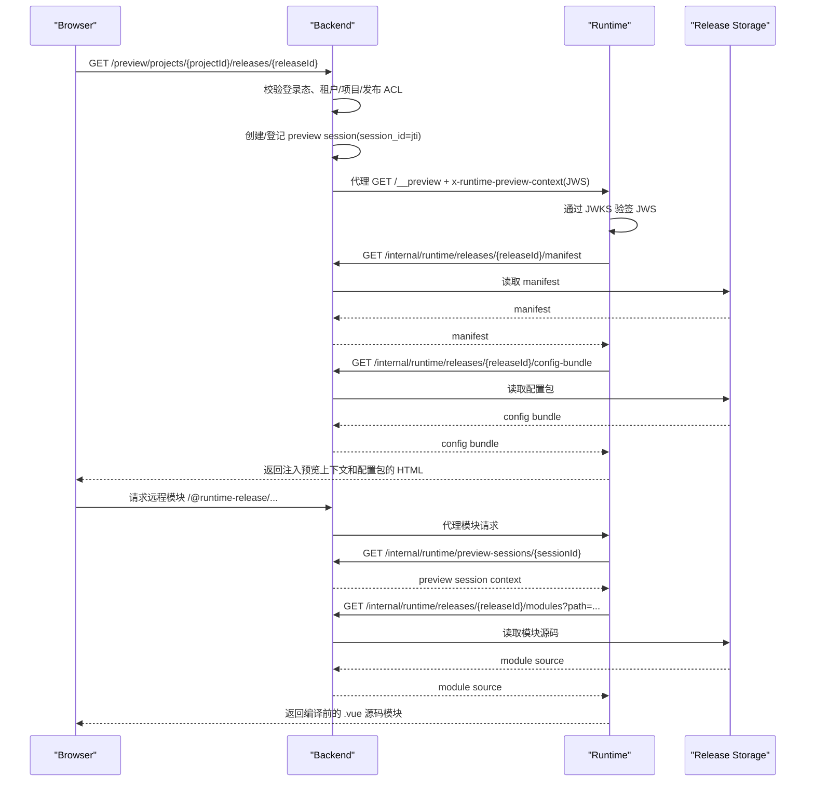

# SaaS 运行时架构与时序

本文档说明浏览器、Backend、Runtime 与发布产物之间的职责边界，以及整项目预览的启动时序。

## 1. 角色划分

### Browser

- 只访问 Backend 暴露的预览地址
- 不直接访问 Runtime 内网地址
- 不持有 Runtime 服务级凭证

### Backend

- 负责用户登录态校验
- 负责租户、项目、发布版本 ACL 校验
- 生成并注入 `x-runtime-preview-context` JWS
- 负责创建或可查询的预览会话记录（以 `jti/session_id` 为主键）
- 反向代理浏览器对 Runtime 的访问
- 对 Runtime 暴露内部只读发布产物 API

### Runtime

- 只负责整项目渲染
- 验签预览上下文 JWS
- 读取预加载配置包
- 基于 manifest 白名单拉取页面模块与资源
- 不提供本地文件写入、作者态编辑或浏览器直连文件系统能力

### 发布产物存储

- 保存不可变的发布版本内容
- 至少包含 manifest、配置包、页面源码与资源索引
- 建议使用对象存储、制品仓库或带版本快照的存储层

## 2. 整项目预览时序

## 3. 运行时启动约束

- Runtime 入口只接受 Backend 代理请求，不接受浏览器绕过 Backend 的直接访问。
- 预览模式下，前端配置层优先读取 `window.__RUNTIME_PRELOADED_CONFIG__`。
- 页面模块若不是 Runtime 本地内建页面，则必须存在于 manifest 白名单中。
- 资源路径优先命中 manifest 的 `assets` 映射，其次再拼接 `asset_base_url`。
- 远程模块请求不依赖 Runtime 进程内缓存恢复上下文，而是通过 `sessionId` 向 Backend 查询独立预览会话。

## 4. 内建页面与远程页面的边界

Runtime 本地保留以下内容：

- 布局壳层
- 默认页面，如 `NotFoundPage`、默认首页、目录页、结束页
- 通用页面容器与公共组件
- 路由、主题、图标、PDF 导出等运行时能力

发布产物远程提供以下内容：

- 项目业务页面 `.vue` 源码
- 发布版配置包
- 图片、字体、图标等静态资源索引

## 5. 设计取舍

- v1 不支持工作区草稿预览
- v1 不支持远程 HMR
- v1 不支持匿名分享链接
- 若未来恢复作者态能力，应新增 Backend 工作区 API，而不是恢复旧的本地编辑器和 `__file-manager`
