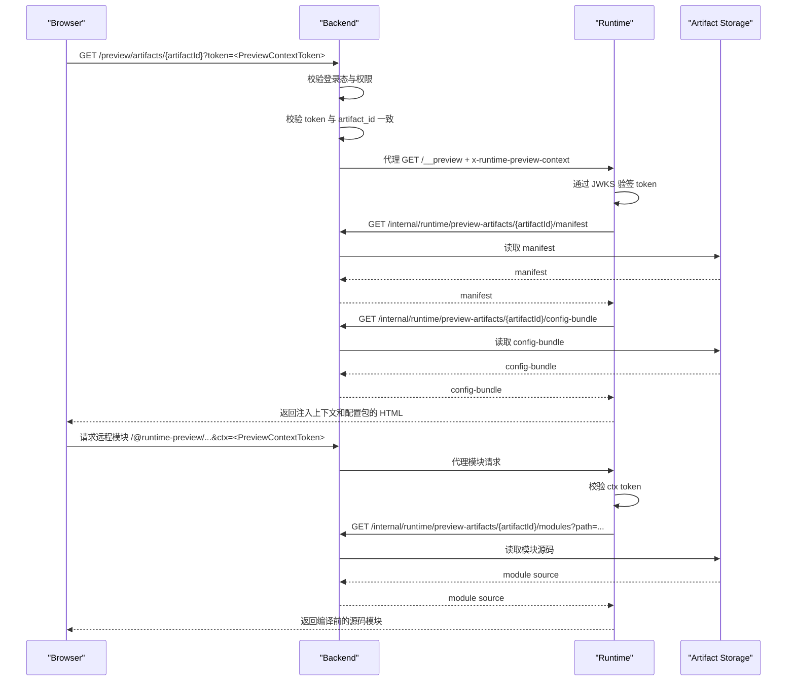

# SaaS 运行时架构与时序

本文档说明 Browser、Backend、Runtime 与 preview artifact 之间的职责边界，以及整项目预览、单页面预览、组件预览共用的无状态启动链路。

## 1. 角色划分

### Browser

- 只访问 Backend 暴露的预览地址。
- 不直接访问 Runtime 内网地址。
- 不持有 Runtime 服务级凭证。

### Backend

- 负责用户登录态校验。
- 负责租户、项目、工作空间权限校验。
- 创建短生命周期 `PreviewArtifact`。
- 签发并注入 `x-runtime-preview-context: <PreviewContextToken>`。
- 反向代理浏览器对 Runtime 的访问。
- 对 Runtime 暴露内部只读 preview artifact API。

### Runtime

- 负责整项目、单页面、组件三类预览渲染。
- 验签预览上下文 token。
- 读取预加载配置包。
- 基于 manifest 白名单拉取页面模块与组件模块。
- 不提供本地文件写入、作者态编辑或浏览器直连文件系统能力。

### Preview Artifact 存储

- 保存短生命周期、不可恢复的 preview artifact 内容。
- 至少包含 manifest、配置包、模块源码与资源索引。
- 建议使用带 TTL 的对象存储、制品仓库或快照存储层。

## 2. 统一启动时序

## 3. 三类预览的入口模型

### 整项目预览

- `preview_kind=project`
- `scope_type=project`
- `entry_descriptor.entry_type=route`
- Runtime 按业务路由启动

### 单页面预览

- `preview_kind=page`
- `scope_type=project`
- `entry_descriptor.entry_type=module`
- Runtime 进入 `StandalonePreviewView`
- 入口模块允许脱离 `manifest.modules` 白名单，但仅对 `entry_descriptor.module_path` 生效

### 组件预览

- `preview_kind=component`
- `scope_type=workspace_component`
- `entry_descriptor.entry_type=component_host`
- Runtime 进入 `ComponentPreviewView`
- 组件预览不要求 `project_id`

## 4. 运行时启动约束

- Runtime 入口只接受 Backend 代理请求，不接受浏览器绕过 Backend 的直接访问。
- 预览模式下，前端配置层优先读取 `window.__RUNTIME_PREVIEW_CONTEXT__` 和 `window.__RUNTIME_PRELOADED_CONFIG__`。
- 普通远程模块若不是 Runtime 本地内建模块，则必须存在于 manifest 白名单中。
- 资源路径优先命中 manifest 的 `assets` 映射，其次再拼接 `asset_base_url`。
- 后续模块请求只依赖 `ctx=<PreviewContextToken>`，不再恢复 preview session。

## 5. 内建页面与远程模块边界

Runtime 本地保留以下内容：

- 布局壳层
- 默认页面，如 `NotFoundPage`
- 通用页面容器与公共组件
- 路由、主题、图标、PDF 导出等运行时能力

Preview artifact 远程提供以下内容：

- 项目业务页面源码
- 工作空间组件源码
- 配置包
- 图片、字体、图标等静态资源索引

## 6. 设计取舍

- 不支持 preview session 持久化与恢复。
- 不支持远程 HMR。
- 不支持匿名分享链接。
- 组件调参状态仅保存在 Editor 本地内存中，不进入 Backend。
- 若未来恢复作者态能力，应新增专门的工作区 API，而不是恢复旧的 preview session 或本地文件桥接能力。
